# Portfolio-Project
## Following are my projects in SQL, Python, Tableau & Excel:  
#### *You can also take a look at my personal website : [www.priyankajha24.wixsite.com](www.priyankajha24.wixsite.com/aboutme)*  
- [x] **SQL** - 
  - Nashville Housing Dataset: Data Cleaning  
*Review the SQL Script:* **[HERE](https://github.com/PriyankaJhaTheAnalyst/DataAnalystPortfolioProjects/blob/main/SQL%20-%20Data%20Cleaning.sql)** 

  - COVID-19 Dataset: Data Exploration   
*Review the SQL Script:* **[HERE](https://github.com/PriyankaJhaTheAnalyst/DataAnalystPortfolioProjects/blob/main/SQL%20-%20Data%20Exploration.sql)** 

- [x] **Python** - 
  - Movies Industry Dataset: Exploratory Data Analysis Project  

*Read the complete Project Analysis in Markdown:* **[HERE](https://github.com/PriyankaJhaTheAnalyst/Python_MoviesIndustry_EDA/blob/main/README.md)** 

- [x] **Tableau** - 

*To view these Tableau Dashboards in Tableau Public, click on the hypertext link.*

- Retail Pricing Analytics Dashboard: https://public.tableau.com/app/profile/priyankajhatheanalyst/viz/RetailPriceAnalyticsDashboard/RetailPricingAnalytics#2

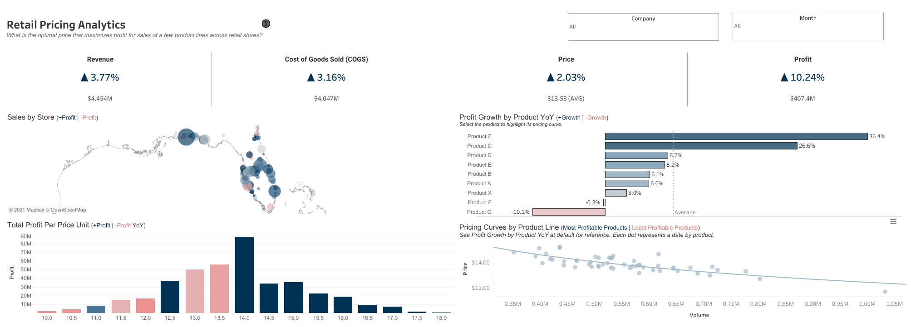

- E-commerce Sales Dashboard: https://public.tableau.com/app/profile/priyankajhatheanalyst/viz/eCommerceSales_16310934566250/ExploratoryVisualAnalysis

- Sales SuperStore Deep Data Analysis (5 Dashboards): https://public.tableau.com/app/profile/priyankajhatheanalyst/viz/SuperStoreDataset5Dashboards/1KPIDashboard 
      
      1 KPI Dashboard

      2 Top Down Dashboard
      
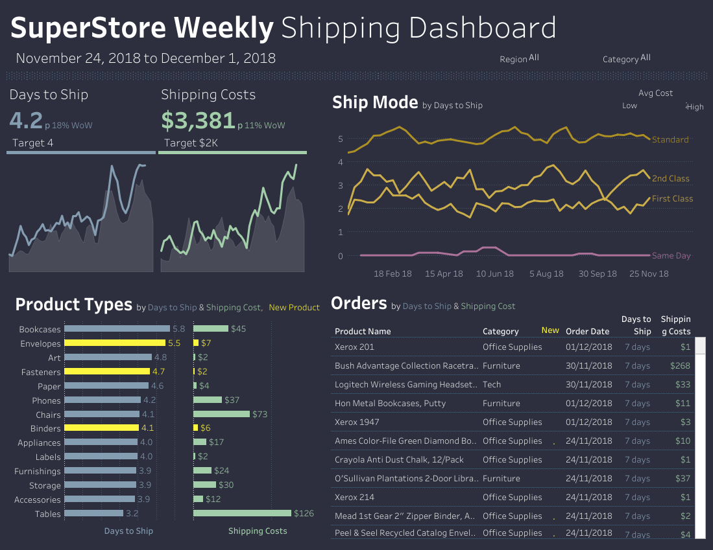

      3 Q&A Dashboard
      

      4 Bottom Up Dashboard
      
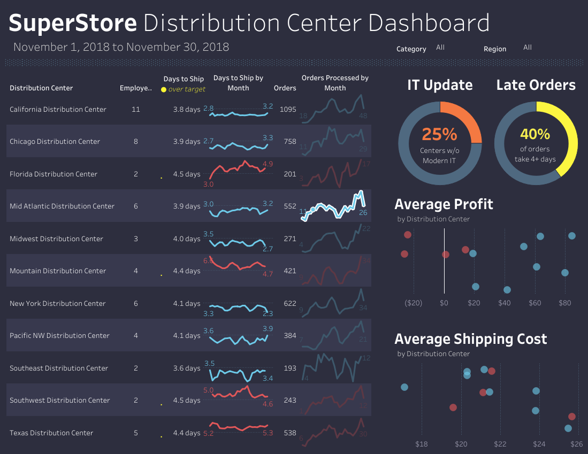

      5 Geo Chart
      
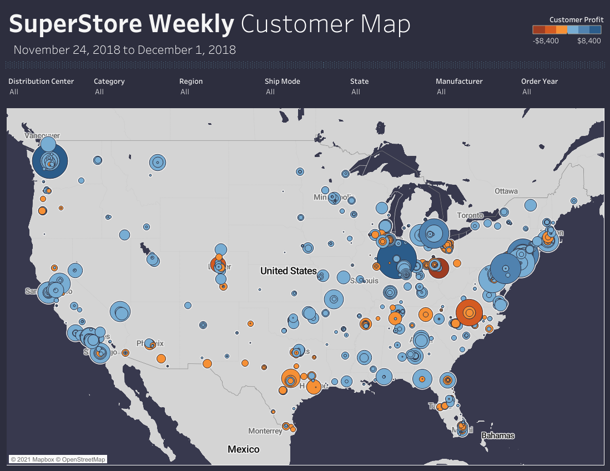

- World Bank CO2 Emissions Dashboard: https://public.tableau.com/views/WorldBankCo2Emissions_16149182681650/Dashboard1?:language=en-GB&:display_count=n&:origin=viz_share_link 

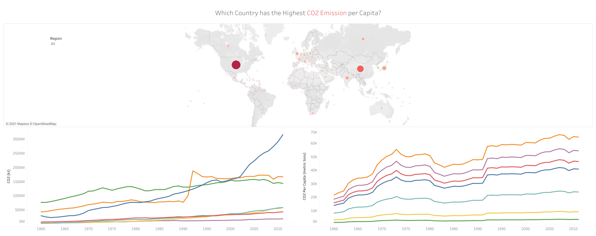

- London Bus Safety Dashboard: https://public.tableau.com/views/TableauCertificationCourse2/ChartsDashboard?:language=en-GB&:display_count=n&:origin=viz_share_link 

- [x] **Excel** - 

*Kindly download these Excel files from this repository and view it in Microsoft Excel.*

- Sales Superstore Sample : Sales Performance Dashboard  

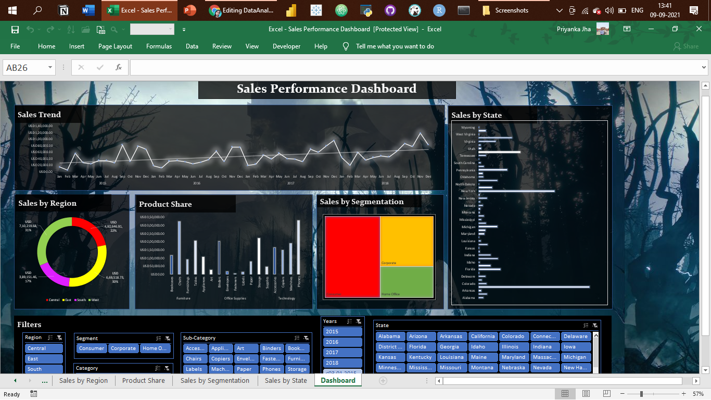

- NetTRON Network Infrastructure Data : LOOKUP, INDEX, MATCH, SUMIFS  

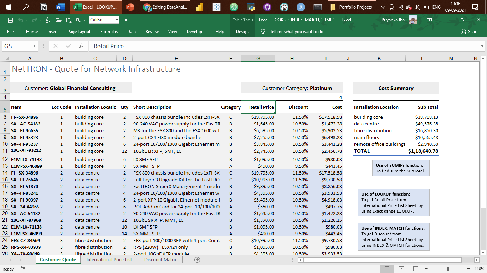

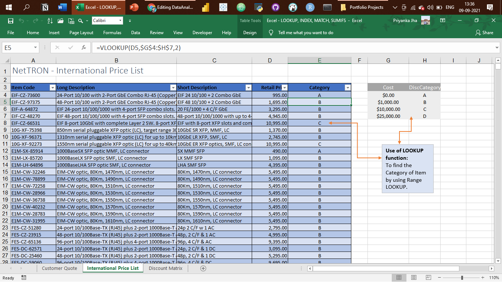

- Shipping Data : Pivot Tables, Pivot Chart, Slicers  

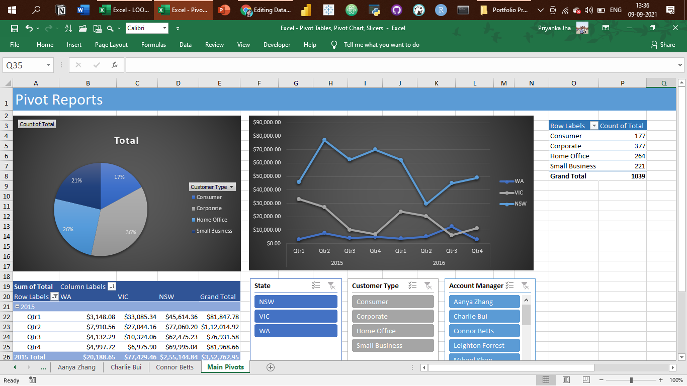

- Project Costing Model Data : Scenario Manager, Solver (Data Modeling)

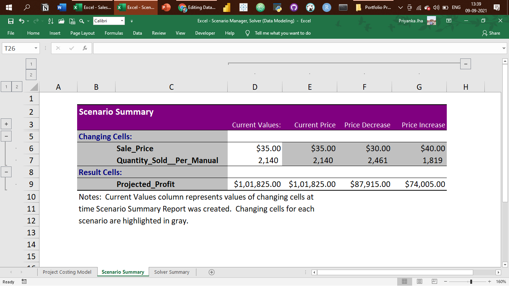

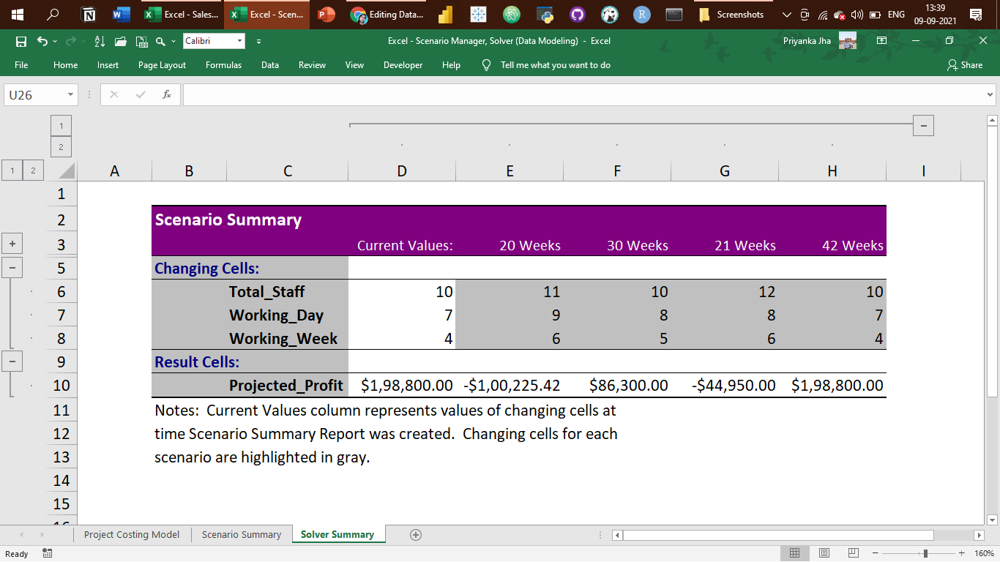
